# Assignment: Using APIs - Week 2

## General Introduction

General instructions how to setup your computer and work on the assignments can be found here:

- [Setup Instructions for HackYourFuture Assignments](https://github.com/HackYourFuture/assignment-utils/blob/main/assignment-docs/SETUP.md)

## Setup

After cloning this repository to your local computer, install the dependencies with the following command:

```bash
npm install
```

## Exercises

The assignment for this week can be found in the `assignment` folder.

To run the exercises in Node.js, `cd` into the `assignment` folder and use the following command:

```bash
node <exercise-file-name>.js
```

For example, to run the first exercise, use:

```bash
node ex1.js
```

> Tip: You can use autocompletion in your terminal to quickly find the exercise files. Start typing `node ex1` and then press the Tab key to let the terminal complete the file name with `.js` for you.

### Running Unit Tests

To ensure your code works as expected, we have provided unit tests for each exercise. You can run these tests using [Jest](https://jestjs.io/), which is already set up in the project.

```bash
npx jest <exercise-file-name>
```

For example, to run the unit test for the first exercise, use:

```bash
npx jest ex1
```

To run all unit tests at once, you can simply use:

```bash
npx jest
```

Or, alternatively, to run all tests you can use the `npm` command:

```bash
npm test
```

The unit tests will check if your implementation meets the requirements specified in the exercise description. If all tests pass, you can be confident that your solution is functionally correct.

These same unit tests will be used to evaluate your submission, so make sure they pass before submitting your assignment.

## Submission

- The latest version of the `main` branch is the final version of your assignment solution.
- You may commit and push code as many times as you want.
- You may use extra branches if you want. But don't forget to merge them to `main`.

The individual exercises will be described in the sections below.

### Exercise 1: Programmer Fun

#### Folder: `ex1`

Who knew programmers could be funny?

#### Instructions - ex1

- **TODO#1**: Complete the function `requestData()` to use `fetch()` to make a request to the URL passed as an argument. Return a promise that resolves with the data. Reject the promise in case of HTTP or network errors.

  Notice that the function `main()` calls `requestData()`, passing it the URL `https://xkcd.now.sh/?comic=latest`. Try and run the code in the browser and open the browser's console to inspect the data returned from the request.

- **TODO#2** Complete the function `renderImage()` to display an image by creating and appending an `` element to the document's body. Use the data returned from the API to set the image source.

  Add an `alt` attribute to the image for [accessibility](https://developer.mozilla.org/en-US/docs/Learn_web_development/Core/Accessibility/HTML#text_alternatives) purposes. Inspect the returned data from the API to see if it includes an appropriate value for the `alt` attribute.

- **TODO#3**: Complete the function `renderError()` to render any errors as an `<h1>` element appended to the document's body.

- **TODO#4**: Refactor the `main()` function to use `async/await`.<br> Test error handling, for instance, by temporarily changing the `.sh` in the URL with `.shx`. There is no server out there at this modified URL; therefore, this should result in a network (DNS) error.

### Exercise 2: Gotta catch 'em all

#### Folder `ex2`

Let's catch all the original 151 Pokemon in our own little web application! Here's an example of what you'll be building for this exercise:

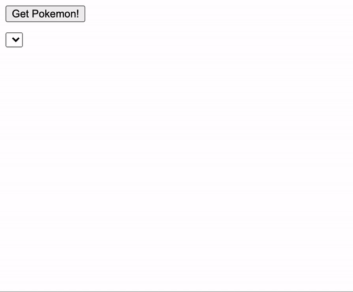

Figure 1. Pokemon App example

In this exercise, you will:

1. Create and append DOM elements using JavaScript only.
2. Fetch data from a public API: <https://pokeapi.co/api/v2/pokemon?limit=151>
3. Display the results in the DOM.

#### Instructions - ex2

- Complete the four functions provided in the starter `index.js` file (see table below). Ensure that the function bodies accurately implement the functionality implied by their names. (A mismatch between a function name and its implementation can lead to confusion.)

- **TODO#1**: In `fetchData()`, make use of `fetch` and its Promise syntax in order to get the data from the public API. Make sure that you check for HTTP errors (`response.ok`) and throw an error if needed. |

- **TODO#2**: In `fetchAndPopulatePokemons()`, call `fetchData()` to load the pokemon data on demand (i.e. when the button is pressed) from the public API and populates the `<select>` element in the DOM.

- **TODO#3**: In `fetchImage()`, call `fetchData()` to fetch the selected image and update the `` element in the DOM (create one if it doesn't exist yet). Use the URL that was returned in the pokemon results array. |

- **TODO#4**: Use the `main()` function to set up the fixed elements in the DOM. Include an event handler for the button that calls `fetchAndPopulatePokemons` when clicked.

  The `main` function should be executed when the window has finished loading and should initialize your app. |

- Feel free to add further helper functions if desired.

- Use async/await to handle promises and try/catch for error handling.

- Test your error handling code (the "unhappy path"). For instance, make the URL invalid and verify that your code handles the resulting error correctly (no runtime errors / unhandled promise rejection warnings in the console). Check this for fetching the pokemons array as well as for fetching the image.

- Try to avoid using global variables. As much as possible, use function parameters and return values to pass data back and forth.

- Use the empty `style.css` file for styling. Use JavaScript to add class name attributes for elements that you wish to style.

### Exercise 3: Roll an ACE

#### File `ex3.js`

> This exercise introduces specially formatted comments, known as _JSDoc type annotations_. We do not expect nor recommend that you use JSDoc annotations during the HackYourFuture curriculum. It is included here as an introduction to the concept of _static type checking_. Later, perhaps during an internship, you are bound to come across _TypeScript_, which implements static type checking in a more fundamental way.
>
> To complete the current assignment you can ignore the JSDoc annotations for now. Just make the code work so that it passes the tests successfully. Once that is done, read up about the benefits of static type checking in the section [Static Type Checking](#static-type-checking) further down below.

Last week, we did an exercise where we threw five dice at once for a game of Poker Dice. In the current exercise, we use only a single die, but now the objective is to keep rethrowing that die until we get an ACE or the die rolls off the table.

The challenge of this exercise is that the outcome of one throw determines whether we need to do a next throw. If the `rollDie()` function resolves to an ACE, then we're done. If not, we need another call to `rollDie()` and wait for it to resolve. We need to repeat this until we get an ACE or the promise rejects.

The exercise file `ex3-rollAnAce.js` includes a function that does just that, using a `.then()` method. It uses a technique called _recursion_ (a function that calls itself) and looks like this:

```js
function rollDiceUntil(wantedValue) {
  return rollDie().then((value) => {
    if (value !== wantedValue) {
      return rollDiceUntil(wantedValue);
    }
    return value;
  });
}
```

Hmm, while this works fine, it is probably a bit difficult to wrap your head around. And it is easy to make a mistake, for instance, by forgetting to include a `return` keyword somewhere (speaking from experience here :wink:).

Luckily, this code can be rewritten to be much simpler, using async/await.

#### Instructions - ex3

- Run the unmodified exercise and observe that it works as advertised. Observe that the die must be thrown an indeterminate number of times until we get an ACE or until it rolls off the table.

- **TODO#1**: Refactor the function `rollDieUntil()` to use async/await instead of `.then()`. Use a `while` loop instead of recursion. Consider what would be a good loop condition for the `while` loop (don't use `true`).

- **TODO#2** Refactor the function `main()` to use async/await and try/catch.

### Static Type Checking

Wikipedia defines [_static type checking_](https://en.wikipedia.org/wiki/Type_system#Type_checking) as follows:

> Static type checking is the process of verifying the type safety of a program
> based on analysis of a program's text (source code). If a program passes a
> static type checker, then the program is guaranteed to satisfy some set of
> type safety properties for all possible inputs.

The bottom line is that static type checking helps write more robust and maintainable code.

#### JSDoc Type Annotations

In VS Code, you may have noticed a pop-up window when you hover your mouse over a function or variable. In the picture below this is demonstrated for the unmodified version of the `requestData()` function of the `ex1-programmerFun` exercise.

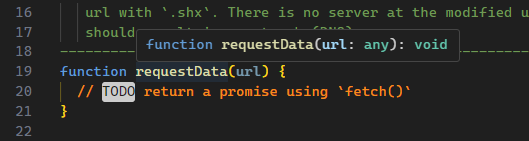

The parameter `url` has been _inferred_ by VS Code to be of type `any`. The parameter name and its _type_ are separated by a colon. The `any` type annotation indicates that the `url` parameter can be any type, e.g. `string`, `number`, `object`, `function` etc. There is no way for VS Code to be more precise. As programmers, we can surmise that we should pass a `string` to the `requestData()` function, notably a string that specifies the `url` from which to request the data. If you pass a `number`, an `object`, or anything other than a `string`, we would anticipate the function to fail.

Note also that VS Code has no clue about the type of data (if any) the `requestData()` function is supposed to return. That is indicated by the `: void` notation following the closing parenthesis of the parameter list. Here, the `void` type indicates that the calling function is not expected to use the return value. Of course, the `TODO` comment in the code tells us otherwise.

Static type checking helps us to ensure that we use the types that our code expects. Because JavaScript itself does not understand type annotations, we cannot directly include them in the same manner as shown in the pop-up window shown above (but wait until you read about TypeScript in a later section).

In exercises `ex3-rollAnAce.js` and `ex4-diceRace.js`, we have used JSDoc comments to indicate to VS Code which types our code expects. In the picture below we have placed the mouse cursor on the `rollDieUntil()` function. VS Code now knows that this function expects a `DieFace` type for its `desiredValue` parameter.

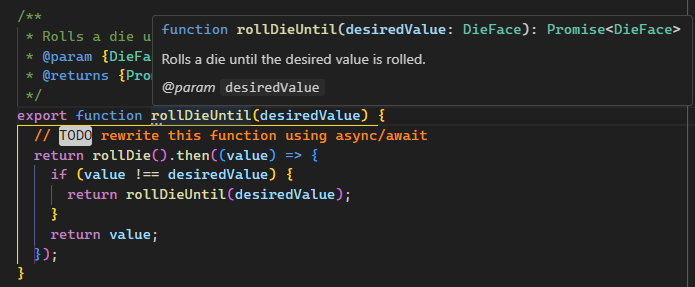

But what constitutes the `DieFace` type? If you hover your mouse pointer over the `@param {DieFace}` line in the JSDoc comment preceding the function VS Code will again show a pop-up window, this time showing the definition of the `DieFace` type.

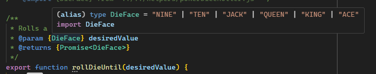

The `DieFace` type is a `string`, further restricted to the listed string constants `"NINE"` ... `"ACE"` (the vertical bar `|` means 'or' here). So, if we pass anything other than one of the expected string constants, all bets are off on how our code will function.

In the pop-up window you can also see that the `rollDieUntil()` function is expected to return a `Promise` that resolves to a value of the type `DieFace`.

In the `main()` function that calls the `rollDieUntil()` function you can still pass something that is not of type `DieFace`. For instance, passing the string `'TWO'` (a valid playing card value but not a poker die face) would mean the die could never settle on `'TWO'`.

Having to hover over code to examine the correct types to use in your code is rather cumbersome. VS Code can flag type violations as errors by adding a special comment to the top of your file:

```js
//@ts-check
```

After adding this comment, a value of an invalid type is now flagged as an error in VS Code, with the usual red squiggly underline:

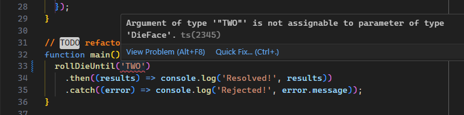

You can also see the error message in the PROBLEMS pane of VS Code:

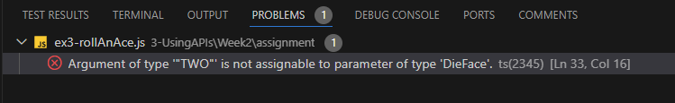

Note that neither VS Code nor JavaScript itself prevents you from running the code while errors are flagged. It remains your responsibility to correct flagged errors.

At this point, you might wonder how VS Code knows about the type definition of `DieFace`. This is done through another comment in the file, just after the `import` statement.

```js
/** @import {DieFace} from "../../helpers/pokerDiceRoller.js" */
```

This informs VS Code that the `DieFace` type is defined in the `pokerDiceRoller.js` file in the `helpers` folder. This file contains many JSDoc annotations. The `DieFace` type is defined in line 12:

```js
/** @typedef {'NINE' | 'TEN' | 'JACK'  | 'QUEEN' | 'KING' | 'ACE'} DieFace */
```

As mentioned before, we do not expect you to add JSDoc type annotations to your own code. At some point (not currently during the HackYourFuture curriculum), you will encounter TypeScript, which implements static type checking in a far more fundamental and convenient way. It is introduced in the next section.

#### TypeScript

Microsoft, the creators of [TypeScript](https://www.typescriptlang.org/), introduce the language as follows:

> TypeScript is **JavaScript with syntax for types**.
>
> TypeScript is a strongly typed programming language that builds on JavaScript, giving you better tooling at any scale.

Because JavaScript itself does not understand the type annotations, a TypeScript file (denoted with a `.ts` instead of a `.js` file extension) must be converted to plain JavaScript (with the type annotations removed) through a process called "transpilation". During this process, if TypeScript detects type errors in your code, it will report those errors to the console. VS Code (and other [IDEs](https://en.wikipedia.org/wiki/Integrated_development_environment) that support TypeScript) will also flag type errors, similar to what we've seen with JSDoc.

As an example, we have provided a version of the [`ex3-rollAnAce`](./typescript/ex3-rollAnAce.ts) exercise, including the function that it imports from [`pokerDiceRoller.ts`](./typescript/pokerDiceRoller.ts) written in TypeScript in the [typescript](./typescript/) folder.

The transpiled (JavaScript) versions of these files can be found in the [`.dist`](../../.dist/3-UsingAPIs/Week2/typescript/) folder. The transpilation was done when you installed this repository with the `npm install` command. If you inspect the transpiled code, you will find that all type annotations are gone. This code is directly executable by the JavaScript engine.

As for JSDoc, we do not expect you to use TypeScript during the HackYourFuture curriculum (although we may change our mind over time :smiley:). If you are interested in learning more, one of the HackYourFuture mentors (and a former graduate) posted a [message](https://hackyourfuture.slack.com/archives/C0EJTP8BY/p1719770993186319) in Slack about their journey learning TypeScript, including a link to a free TypeScript book.

### Exercise 4: Dice Race

#### File `ex4.js`

In this exercise, we will again throw five dice at once, but this time we are only interested in the first die that settles successfully (promise resolved) or rolls off the table (promise rejected). This is something for which the `Promise.race()` method seems to be ideal. If you successfully completed Exercise 4 last week, this one should be easy:

#### Instructions - ex4

- **TODO#1**: Complete the function `rollDice()` by using `.map()` on the `dice` array to create an array of promises for use with `Promise.race()`.

- **TODO#2**: Refactor the function `main()` using async/await and try/catch.

- **TODO#3**: Once you get this working, you may observe that some dice continue rolling for an undetermined time after the promise returned by `Promise.race()` resolves. Do you know why? Replace the placeholder text with your explanation.

### Exercise 5: Using the VS Code Debugger

#### File: `ex5.js`

In this exercise, we will practice working with the VS Code Debugger. You can just follow along as we go. Note that we will not work with the browser this time. Instead, all output will be logged to the terminal window.

> Read more about debuggers in general in the Study Guide: [Debuggers](https://hackyourfuture.github.io/study/#/tools/debuggers)

This exercise will make a fetch request to the [Nobel Prize API](https://www.nobelprize.org/about/developer-zone-2/) version 2 to obtain information about the Nobel Prize winners ("laureates"). Specifically, those born in the Netherlands. We will log this information to the console.

This is the expected output:

<!-- cspell:disable -->

```console
Name: Bernard L. Feringa
Birth: 1951-05-18, Barger-Compascuum, the Netherlands

Name: Christiaan Eijkman
Birth: 1858-08-11, Nijkerk, the Netherlands
Death: 1930-11-05, Utrecht, the Netherlands

...

Name: Tobias Asser
Birth: 1838-04-28, Amsterdam, the Netherlands
Death: 1913-07-29, the Hague, the Netherlands
```

<!-- cspell:enable -->

Let's examine the (buggy) starter code of this exercise first:

```js
const fetch = require('node-fetch');

async function getData(url) {
  const response = await fetch(url);
  return response.json();
}

function renderLaureate({ knownName, birth, death }) {
  console.log(`\nName: ${knownName.en}`);
  console.log(`Birth: ${birth.date}, ${birth.place.locationString}`);
  console.log(`Death: ${death.date}, ${death.place.locationString}`);
}

function renderLaureates(laureates) {
  laureates.forEach(renderLaureate);
}

async function fetchAndRender() {
  try {
    const laureates = getData(
      'http://api.nobelprize.org/2.0/laureates?birthCountry=Netherlands&format=json&csvLang=en'
    );
    renderLaureates(laureates);
  } catch (err) {
    console.error(`Something went wrong: ${err.message}`);
  }
}

fetchAndRender();
```

> The `fetch` function is normally only available in the browser. However, we can make it also available in node-based applications by use of a special library package, called `node-fetch`. This is the purpose of the `require()` call at the top of the file. You will learn more about using library packages in the Node.js curriculum module.

The developer/author wrote this initial code after experimenting with the online demos on the Nobel Prize API site. Although seemingly well-structured, this code will not work as planned. The challenge of this exercise is to find and fix the bugs (there are a couple). We will use the VS Code debugger as our preferred debugging tool.

Let's first run the unmodified starter code. When we do, we will get this rather disappointing output:

```console
Something went wrong: laureates.forEach is not a function
```

It's excellent that our code catches and handles errors, but when debugging, we'd like more detailed error information. One way to achieve this is to comment out the `try {` statement and the `catch` block so that errors are not caught. By default, we will then get an error message with a (call) stack trace in the console. A less intrusive way to achieve the same is to log the `stack` property of the `Error` object to the console inside the `catch` block:

```js
async function fetchAndRender() {
  try {
    ...
  } catch (err) {
    console.error(`Something went wrong: ${err.message}`);
    console.log(err.stack);
  }
}
```

This will give us some information about where the error occurred:

<!-- cspell:disable -->

```console
Something went wrong: laureates.forEach is not a function
TypeError: laureates.forEach is not a function
    at renderLaureates (C:\Users\jimcr\dev\hackyourfuture\homework\3-UsingAPIs\Week2\homework\ex5-vscDebug.js:19:13)
    at fetchAndRender (C:\Users\jimcr\dev\hackyourfuture\homework\3-UsingAPIs\Week2\homework\ex5-vscDebug.js:27:5)
    at processTicksAndRejections (internal/process/task_queues.js:93:5)
```

<!-- cspell:enable -->

The stack trace gives us detailed information about the sequence of functions called when the error occurred, from most recent to least recent. Of direct interest is the most recent call: we can see that the error occurred in line 19, column 13 of the file `ex5-vscDebug.js`:

```js
18| function renderLaureates(laureates) {
19|   laureates.forEach(renderLaureate);
20| }
```

Error messages in JavaScript can be a bit cryptic sometimes. We know that `.forEach()` should definitely work on an array. Since we trust JavaScript not to play tricks on us, we conclude that, contrary to our expectation, the `laureates` value passed as an argument cannot be an array.

First, let's try adding a `console.log` to see the actual value of `laureates`.

> :bulb: When you use `console.log` statements for debugging purposes it is helpful to label the output so that you know what is being logged. In the example below we used the label `laureates:`.

```js
function renderLaureates(laureates) {
  console.log('laureates:', laureates);
  laureates.forEach(renderLaureate);
}
```

When we run the code we now get:

<!-- cspell:disable -->

```js
laureates: Promise { <pending> }
Something went wrong: laureates.forEach is not a function
TypeError: laureates.forEach is not a function
    at renderLaureates (C:\Users\jimcr\dev\hackyourfuture\homework\3-UsingAPIs\Week2\homework\ex5-vscDebug.js:20:13)
    at fetchAndRender (C:\Users\jimcr\dev\hackyourfuture\homework\3-UsingAPIs\Week2\homework\ex5-vscDebug.js:28:5)
    at Object.<anonymous> (C:\Users\jimcr\dev\hackyourfuture\homework\3-UsingAPIs\Week2\homework\ex5-vscDebug.js:35:1)
    at Module._compile (internal/modules/cjs/loader.js:1063:30)
    at Object.Module._extensions..js (internal/modules/cjs/loader.js:1092:10)
    at Module.load (internal/modules/cjs/loader.js:928:32)
    at Function.Module._load (internal/modules/cjs/loader.js:769:14)
    at Module.require (internal/modules/cjs/loader.js:952:19)
    at require (internal/modules/cjs/helpers.js:88:18)
    at runExercise (C:\Users\jimcr\dev\hackyourfuture\homework\test-runner\run-it.js:54:7)
```

<!-- cspell:enable -->

Aha! We were expecting an array but actually got a (pending) Promise. If we look at the stack trace again (the second line), we can see that the `renderLaureates()` function was called by the `fetchAndRender()` function in line 28, passing the `laureates` variable as an argument. This variable was initialized just before the call. We now realize we forgot to add the `await` keyword before the call to `getData()` to wait for the promise it returns to resolve. (Forgetting to add `await` is an easy mistake to make.) Let's fix that:

```js
async function fetchAndRender() {
  try {
    const laureates = await getData(
      'http://api.nobelprize.org/2.0/laureates?birthCountry=Netherlands&format=json&csvLang=en'
    );
    renderLaureates(laureates);
  } catch (err) {
    console.error(`Something went wrong: ${err.message}`);
  }
}
```

Let's now run the code again:

<!-- cspell:disable -->

```console
{
  laureates: [
    {
      id: '933',
      knownName: [Object],
      givenName: [Object],
      familyName: [Object],
      fullName: [Object],
      gender: 'male',
      birth: [Object],
      links: [Object],
      nobelPrizes: [Array]
    },
    ...
    {
      id: '478',
      knownName: [Object],
      givenName: [Object],
      familyName: [Object],
      fullName: [Object],
      gender: 'male',
      birth: [Object],
      death: [Object],
      links: [Object],
      nobelPrizes: [Array]
    }
  ],
  meta: { offset: 0, limit: 25, birthCountry: 'Netherlands', count: 18 },
  links: {
    first: 'http://masterdataapi.nobelprize.org/2.0/laureates?offset=0&limit=25&birthCountry=Netherlands',
    self: 'http://masterdataapi.nobelprize.org/2.0/laureates?offset=0&limit=25&birthCountry=Netherlands',
    last: 'http://masterdataapi.nobelprize.org/2.0/laureates?offset=0&limit=25&birthCountry=Netherlands'
  }
}
Something went wrong: laureates.forEach is not a function
TypeError: laureates.forEach is not a function
    at renderLaureates (C:\Users\jimcr\dev\hackyourfuture\homework\3-UsingAPIs\Week2\homework\ex5-vscDebug.js:20:13)
    at fetchAndRender (C:\Users\jimcr\dev\hackyourfuture\homework\3-UsingAPIs\Week2\homework\ex5-vscDebug.js:28:5)
    at processTicksAndRejections (internal/process/task_queues.js:93:5)
```

<!-- cspell:enable -->

Wow, that's a lot of output, but it's still not right. But at least we're getting some form of data. Let's switch from using `console.log()` to the VS Code debugger as our preferred debugging tool. First, delete the temporary `console.log` line we added to the `renderLaureates()` function.

> A quick way to delete a line is to place the cursor anywhere on that line and press a keyboard shortcut:
>
> | Operating system | Key combination |
> | ---------------- | --------------- |
> | Mac              | ⇧⌘K             |
> | Windows          | Ctrl+Shift+K    |
> | Linux            | Ctrl+Shift+K    |
>
> Table 1. Keyboard shortcuts for Delete Line.

Now, from the VS Code sidebar, click the Debug button (indicated by the red arrow in Figure 2).

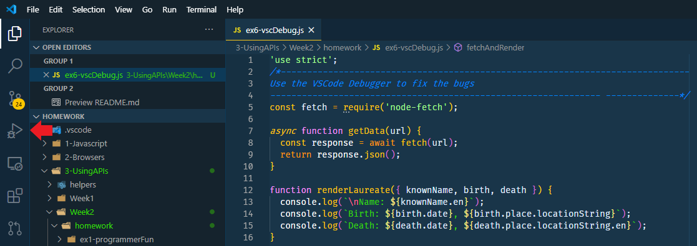

> Figure 2. Debug button.

From the resulting screen, select **JavaScript Debug Terminal** (Figure 3):

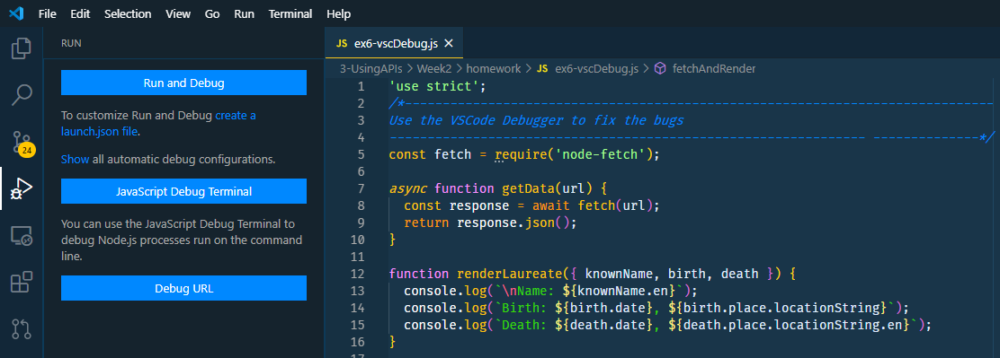

> Figure 3. Debug options.

This will open a VS Code Integrated Terminal at the bottom of the screen. You can see this is a Debug Terminal and not a regular terminal by inspecting the dropdown in the upper-right corner of the terminal panel (Figure 4):

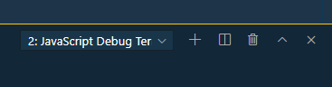

Figure 4. Integrated Terminal drop-down.

You can have multiple terminal windows open in VS Code and switch between them using this dropdown. For now, we will stick to the Debug Terminal.

We can now place a **breakpoint** on line 19 by clicking to the left of the number 19 in the editor's left margin until a red dot appears, as shown in Figure 5 (to remove it, click the dot again):

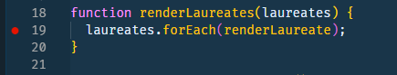

Figure 5. Breakpoint set at line 19.

A **breakpoint** is a location in our code where we want the JavaScript engine to pause execution when we run the program with the debugger attached. Let's give that a try and see what it looks like. We'll use the convenient `npm run it` command again (Figure 6 - notice the line that says _Debugger attached._):

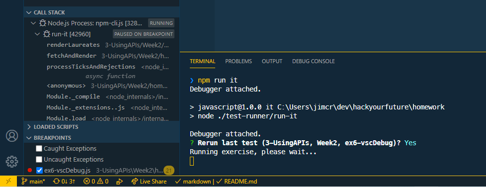

Figure 6. Debugger Attached.

We can inspect the call stack and any breakpoints in the lower-left portion of the screen, as shown in Figure 6.

When executing code with the debugger, execution pauses as soon as a breakpoint is "hit". In Figure 7, we can see that execution is paused at our breakpoint on line 19. This is indicated by the yellow marker enclosing the red dot of the breakpoint.

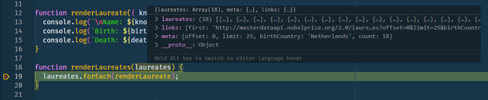

Figure 7. Breakpoint hit at line 19.

There are several things we can inspect while execution is paused. For instance, as shown in Figure 7, we can hover the mouse pointer over the `laureates` parameter of the `renderLaureates()` function to inspect its value at this point in the execution. Array and object values can be expanded by clicking the triangular right-arrow.

We can also inspect variables and the scopes in which they exist. In Figure 8, we have expanded the `laureates` variable. It appears this variable is not an array, as we assumed, but a JavaScript object with a `laureates` property containing an array.

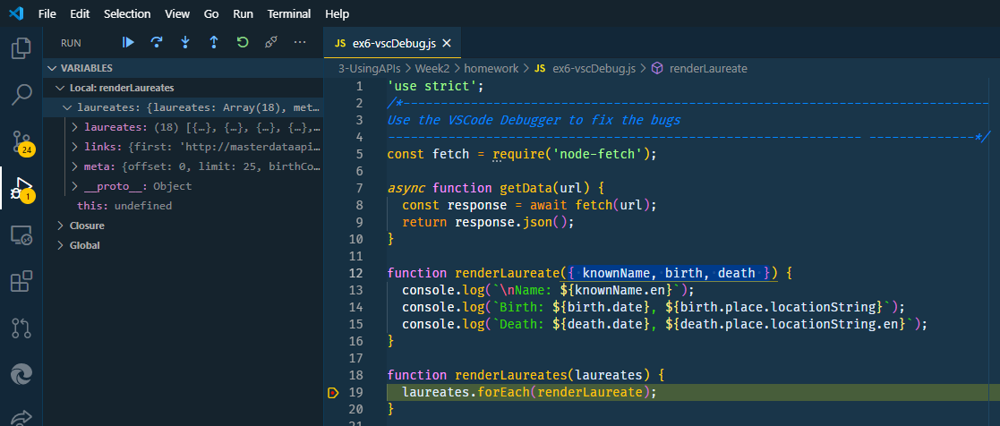

Figure 8. Variables and scopes

With that knowledge, we can fix the problem using modern JavaScript **object destructuring**: we can enclose the `laureates` variable in curly braces to assign it the value of the `laureates` property rather than the data object itself. But first, we need to let the debugger finish the current execution. Press the blue triangle button in the top-left part of the screen (see Figure 8) to resume execution.

```js
async function fetchAndRender() {
  try {
    // object destructuring curly braces added:
    const { laureates } = await getData(
      'http://api.nobelprize.org/2.0/laureates?birthCountry=Netherlands&format=json&csvLang=en'
    );
    renderLaureates(laureates);
  } catch (err) {
    console.error(`Something went wrong: ${err.message}`);
  }
}
```

When we run the code again in the debugger, we can see (Figure 9) that the `laureates` variable is now the array we expected.

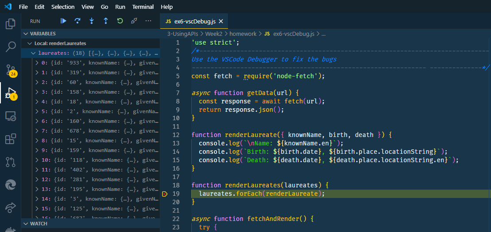

Figure 9. Variable `laureates` after object-destructuring.

Next, click the blue triangle button to resume execution. Hmm, this output still doesn't look right:

<!-- cspell:disable -->

```console
Name: Bernard L. Feringa
Birth: 1951-05-18, [object Object]

Name: Christiaan Eijkman
Birth: 1858-08-11, [object Object]
Death: 1930-11-05, [object Object]

...


Name: Tobias Asser
Birth: 1838-04-28, [object Object]
Death: 1913-07-29, [object Object]
Waiting for the debugger to disconnect...
Waiting for the debugger to disconnect...
```

<!-- cspell:enable -->

Apparently, where we expected an object with a `date` property, we actually got an undefined value on line 15 in the `renderLaureate()` function. By inspecting line 15, we can infer that the object in question is the `death` object. Let's place another breakpoint on line 15, but this time, we'll make it a _conditional_ breakpoint. Right-click to the left of the number 15 in the editor's margin and select **Add conditional breakpoint...** from the context menu. Enter the condition we want to break on: `death === undefined`, as illustrated in Figure 10.

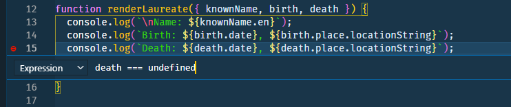

Figure 10. Setting a conditional breakpoint.

When we run the code again, the breakpoint at line 19 will be hit first. Press the blue triangle button again to resume execution. Next, the breakpoint at line 15 will be hit when the condition is satisfied. Inspecting the `Variables` panel reveals the laureate in question is still alive because their `death` property is `undefined`. We acknowledge that this is a perfectly reasonable possibility our code must handle.

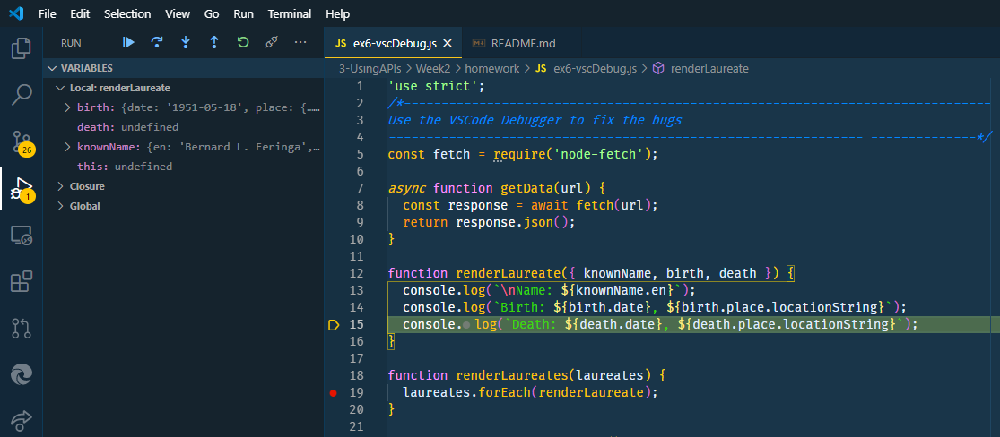

Figure 11. Conditional breakpoint hit.

We will add an `if` statement to handle this (we will test for `death` being _truthy_):

```js
function renderLaureate({ knownName, birth, death }) {
  console.log(`\nName: ${knownName.en}`);
  console.log(`Birth: ${birth.date}, ${birth.place.locationString}`);
  if (death) {
    console.log(`Death: ${death.date}, ${death.place.locationString}`);
  }
}
```

Let's remove the two breakpoints by right-clicking on them and selecting **Remove Breakpoint** from the context menu.

Now, when we run the code again, we get close to the desired result:

<!-- cspell:disable -->

```console
Name: Bernard L. Feringa
Birth: 1951-05-18, [object Object]

Name: Christiaan Eijkman
Birth: 1858-08-11, [object Object]
Death: 1930-11-05, [object Object]

...


Name: Tobias Asser
Birth: 1838-04-28, [object Object]
Death: 1913-07-29, [object Object]
Waiting for the debugger to disconnect...
Waiting for the debugger to disconnect...
```

<!-- cspell:enable -->

We still have an issue with displaying the locations for `birth` and `death`. We will leave this as a debugging exercise for you to finish. Don't forget to remove the `console.log` statement for the stack trace in the `catch` block when you're done. It's fine for us developers, but regular users may get confused or alarmed when confronted with a stack trace.

For more information about the VS Code debugger, visit: [Debugging in Visual Studio Code](https://code.visualstudio.com/docs/editor/debugging).

### Exercise 6: Using the Browser Debugger

#### Folder: `ex6`

This exercise is about debugging code similar to the previous one, but this time the program is web-based. Instead of the VS Code Debugger, you must now use the browser's built-in debugger, which has very similar features. Rather than repeating all the steps in detail here, we refer you to an excellent tutorial on how to use this tool, available online:

- [The definitive guide to JavaScript Debugging [2021 Edition]](https://dev.to/atapas/the-definitive-guide-to-javascript-debugging-2021-edition-116n)
